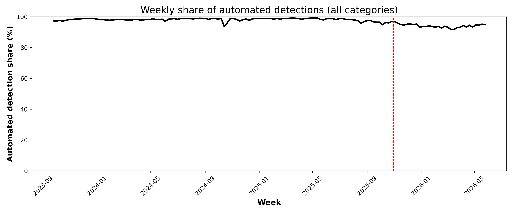
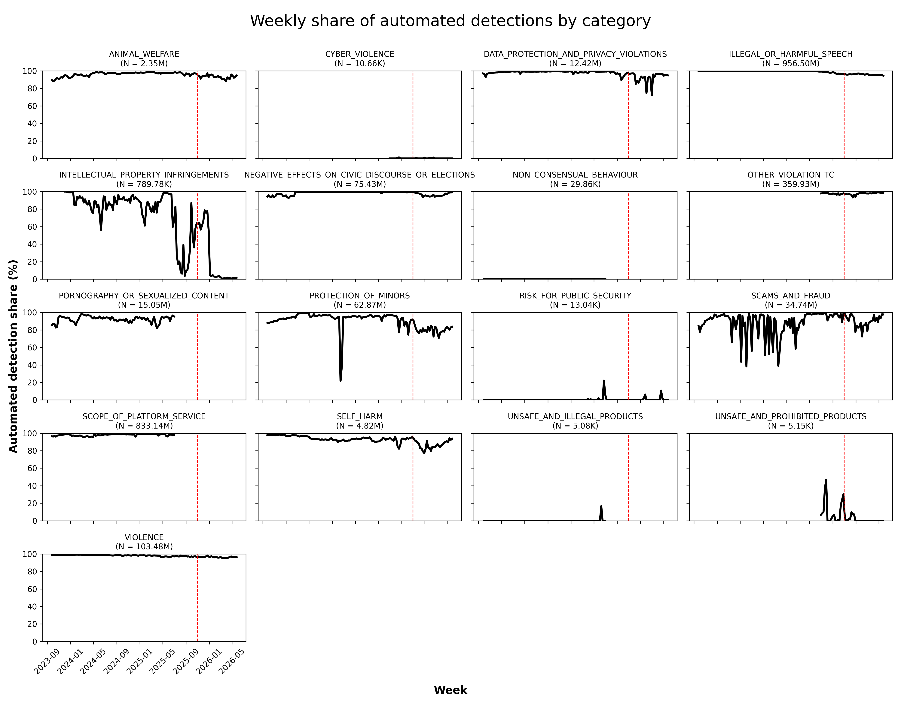
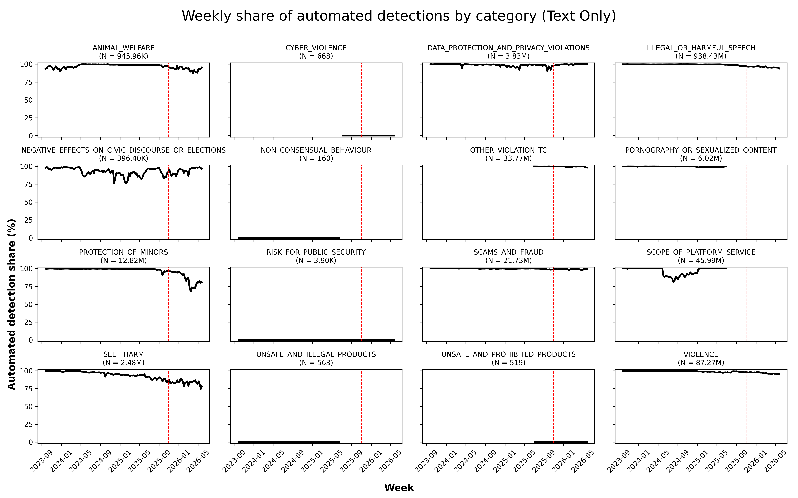
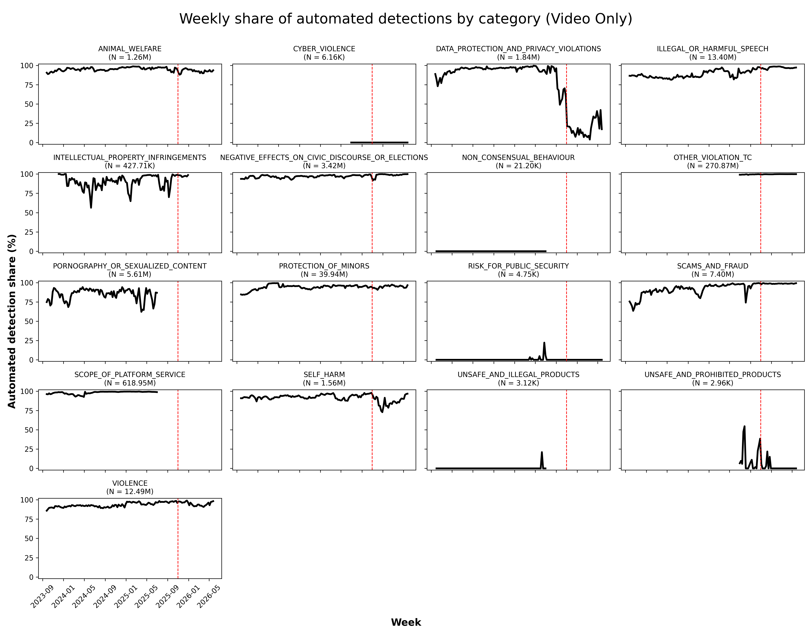
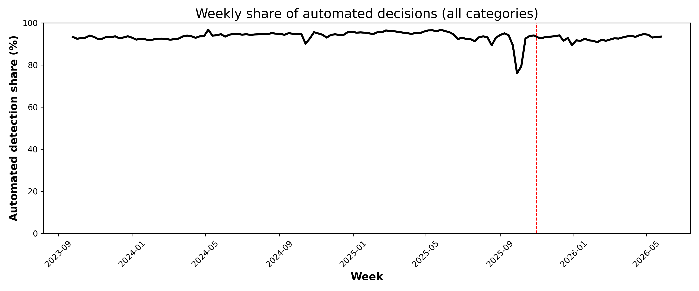
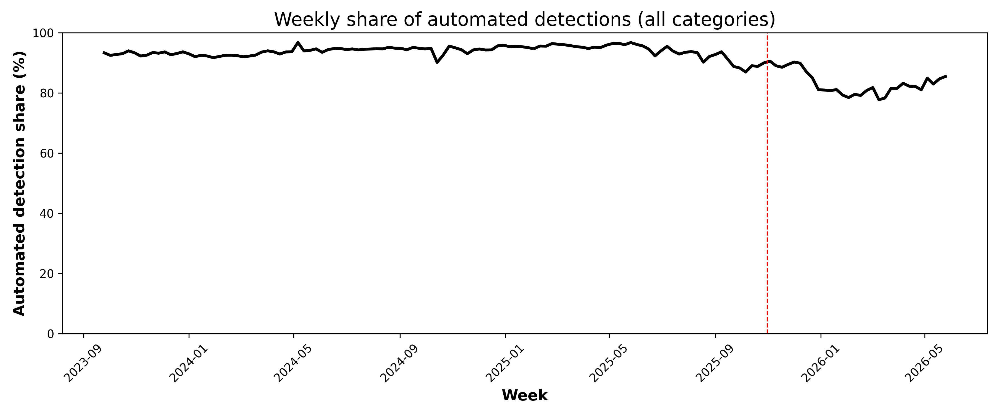
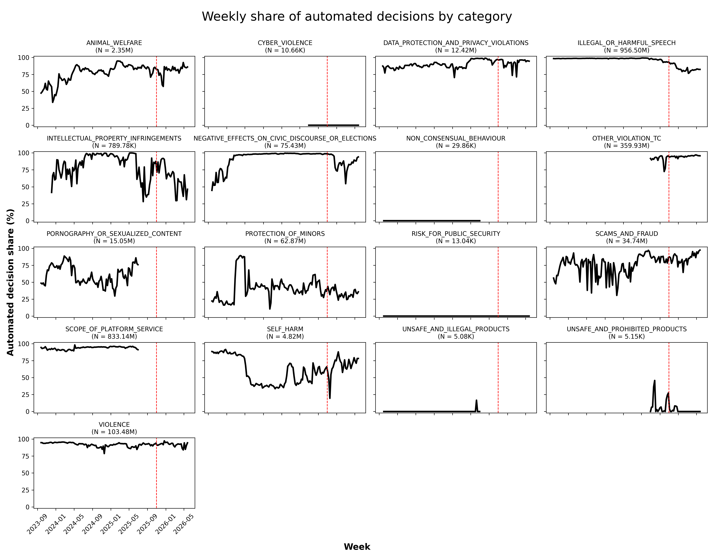
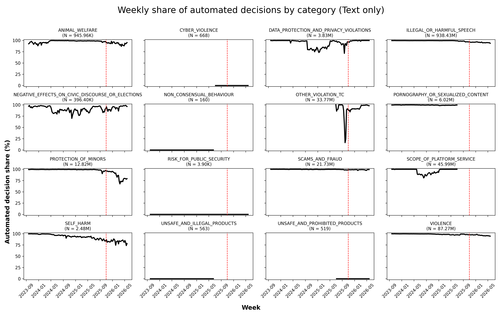
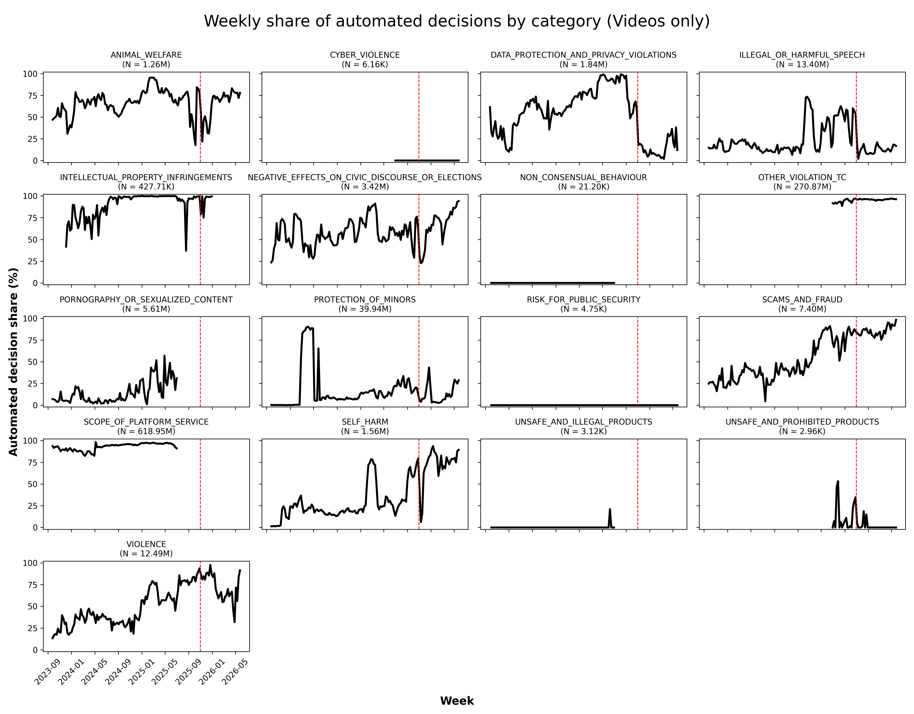

# TikTok Moderation Automation
Descriptive figures for automated moderation detection and decisions on TikTiok 2023-2026. Data from the [DSA Transparency Database](URL). 

Arround October 31st, 2025, TikTok fired the Entire German Trust and Safety team, according to [news reports](https://www.tagesspiegel.de/berlin/berliner-wirtschaft/arbeitskampf-bei-tiktok-beendet-content-moderatoren-erhalten-abfindungen-14780273.html). This date is marked as the cut-off date in the plots below. 

# Moderation Detection Automation

Automated detection shares pre/post October 31st, 2025 

| Automated Detection | Pre | Post |
|--------------------|----------|----------|
| False              | 0.015774 | 0.030542 |
| True               | 0.984226 | 0.969458 |

## Detection - All

Weekly share of automated moderation detections on TikTok for all content. 

Weekly share of automated moderation detections on TikTok excluding Other TC Violations category. 

Weekly share of automated moderation detections on TikTok for all content by category. 

---

## Detection - Text

Weekly share of automated moderation detections on TikTok for video content only. 

---

## Detection - Video

Weekly share of automated moderation detections on TikTok for text content only.  

---

# Moderation Decision Automation

Automated decision shares pre/post October 31st, 2025 

| Automated Decision | Pre | Post |
|--------------------|----------|----------|
| False              | 0.056624 | 0.073034 |
| True               | 0.943376 | 0.926966 |

## Decision - All

Weekly share of automated moderation decisions on TikTok for all content. 

Weekly share of automated moderation decisions on TikTok excluding Other TC Violations category. 

Weekly share of automated moderation decisions on TikTok for all content by category. 

---

## Decision - Text

Weekly share of automated moderation decisions on TikTok for video content only. 

---

## Decision - Video

Weekly share of automated moderation decisions on TikTok for text content only. 

